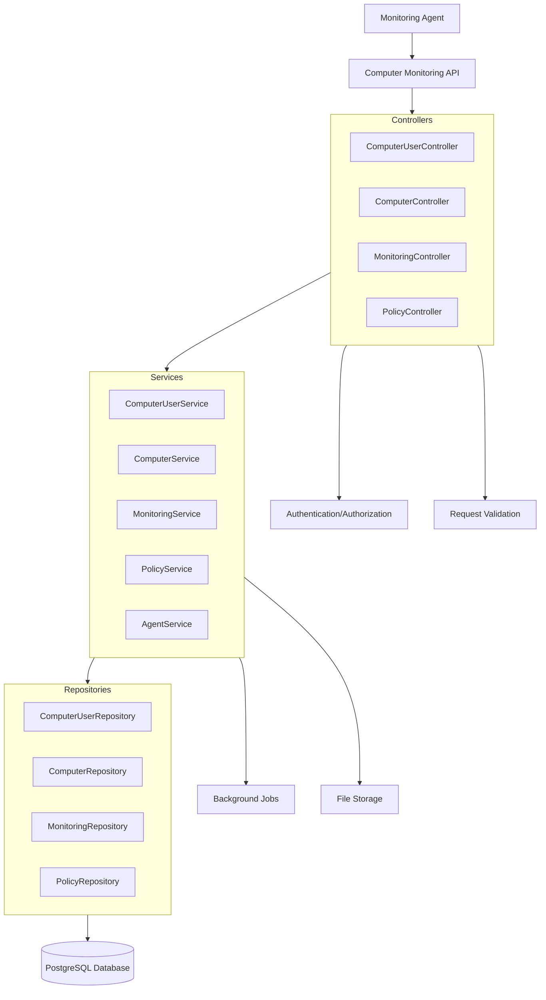
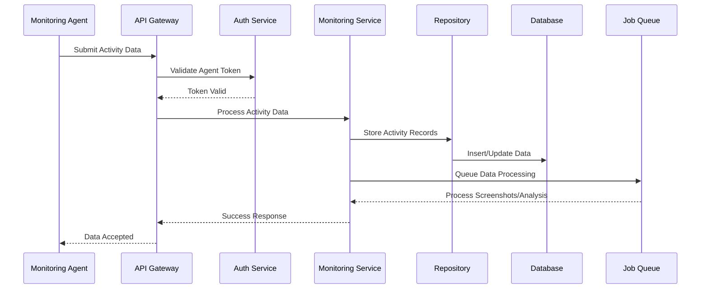

# Computer Monitoring System Design

## Overview

The Computer Monitoring System is a comprehensive solution for tracking and managing computer usage within organizations. It provides real-time monitoring of employee computer activities, manages computer user associations, and offers detailed reporting capabilities while maintaining privacy controls and role-based access.

The system consists of multiple interconnected modules that handle computer user management, activity monitoring, policy configuration, and data collection from monitoring agents.

## Architecture

### High-Level Architecture



### Data Flow Architecture



## Components and Interfaces

### 1. Computer User Management Module

#### ComputerUserController
```typescript
@Controller('computer-users')
export class ComputerUserController {
  // GET /computer-users - List computer users with role-based filtering
  async getComputerUsers(query: QueryDto, scope: DataScope, user: UserContext)
  
  // GET /computer-users/unlinked - Get unlinked computer users
  async getUnlinkedComputerUsers(scope: DataScope, user: UserContext)
  
  // POST /computer-users/:id/link-employee - Link computer user to employee
  async linkComputerUserToEmployee(id: number, dto: LinkEmployeeDto, scope: DataScope, user: UserContext)
  
  // DELETE /computer-users/:id/unlink-employee - Unlink computer user from employee
  async unlinkComputerUserFromEmployee(id: number, scope: DataScope, user: UserContext)
}
```

#### ComputerUserService
```typescript
@Injectable()
export class ComputerUserService {
  async getComputerUsers(query: QueryDto, scope: DataScope, user: UserContext)
  async getUnlinkedComputerUsers(scope: DataScope, user: UserContext)
  async linkToEmployee(computerUserId: number, employeeId: number, scope: DataScope, user: UserContext)
  async unlinkFromEmployee(computerUserId: number, scope: DataScope, user: UserContext)
  async registerComputerUser(registrationData: RegisterComputerUserDto)
}
```

### 2. Computer Management Module

#### ComputerController
```typescript
@Controller('computers')
export class ComputerController {
  // GET /computers - List computers with filtering
  async getComputers(query: QueryDto, scope: DataScope, user: UserContext)
  
  // GET /computers/:id/users - Get users for specific computer
  async getComputerUsers(id: number, scope: DataScope, user: UserContext)
}
```

#### ComputerService
```typescript
@Injectable()
export class ComputerService {
  async getComputers(query: QueryDto, scope: DataScope, user: UserContext)
  async getComputerUsers(computerId: number, scope: DataScope, user: UserContext)
  async registerComputer(computerData: RegisterComputerDto)
  async updateComputerStatus(computerId: number, status: ComputerStatus)
}
```

### 3. Activity Monitoring Module

#### MonitoringController
```typescript
@Controller('monitoring')
export class MonitoringController {
  // GET /monitoring/active-windows - Get active window data
  async getActiveWindows(query: MonitoringQueryDto, scope: DataScope, user: UserContext)
  
  // GET /monitoring/visited-sites - Get visited sites data
  async getVisitedSites(query: MonitoringQueryDto, scope: DataScope, user: UserContext)
  
  // GET /monitoring/screenshots - Get screenshot data
  async getScreenshots(query: MonitoringQueryDto, scope: DataScope, user: UserContext)
  
  // GET /monitoring/user-sessions - Get user session data
  async getUserSessions(query: MonitoringQueryDto, scope: DataScope, user: UserContext)
  
  // GET /monitoring/employee/:employee_id/activity - Get employee activity report
  async getEmployeeActivity(employeeId: number, query: ActivityQueryDto, scope: DataScope, user: UserContext)
  
  // GET /monitoring/computer-user/:computer_user_id/activity - Get computer user activity
  async getComputerUserActivity(computerUserId: number, query: ActivityQueryDto, scope: DataScope, user: UserContext)
  
  // POST /monitoring/agent-data - Submit monitoring data from agent
  async submitAgentData(data: AgentDataDto)
  
  // POST /monitoring/register-computer-user - Register new computer user
  async registerComputerUser(data: RegisterComputerUserDto)
}
```

#### MonitoringService
```typescript
@Injectable()
export class MonitoringService {
  async getActiveWindows(query: MonitoringQueryDto, scope: DataScope, user: UserContext)
  async getVisitedSites(query: MonitoringQueryDto, scope: DataScope, user: UserContext)
  async getScreenshots(query: MonitoringQueryDto, scope: DataScope, user: UserContext)
  async getUserSessions(query: MonitoringQueryDto, scope: DataScope, user: UserContext)
  async getEmployeeActivityReport(employeeId: number, query: ActivityQueryDto, scope: DataScope, user: UserContext)
  async getComputerUserActivityReport(computerUserId: number, query: ActivityQueryDto, scope: DataScope, user: UserContext)
  async processAgentData(data: AgentDataDto)
  async calculateProductivityMetrics(activityData: ActivityData[], policy: Policy)
}
```

### 4. Policy Management Module

#### PolicyController
```typescript
@Controller('policies')
export class PolicyController {
  // GET /policies - List monitoring policies
  async getPolicies(query: QueryDto, scope: DataScope, user: UserContext)
  
  // POST /policies - Create new policy
  async createPolicy(dto: CreatePolicyDto, scope: DataScope, user: UserContext)
  
  // PUT /policies/:id - Update policy
  async updatePolicy(id: number, dto: UpdatePolicyDto, scope: DataScope, user: UserContext)
  
  // DELETE /policies/:id - Delete policy
  async deletePolicy(id: number, scope: DataScope, user: UserContext)
}
```

#### PolicyService
```typescript
@Injectable()
export class PolicyService {
  async getPolicies(query: QueryDto, scope: DataScope, user: UserContext)
  async createPolicy(dto: CreatePolicyDto, scope: DataScope, user: UserContext)
  async updatePolicy(id: number, dto: UpdatePolicyDto, scope: DataScope, user: UserContext)
  async deletePolicy(id: number, scope: DataScope, user: UserContext)
  async validatePolicyConfiguration(config: PolicyConfiguration)
  async applyPolicyToEmployees(policyId: number, employeeIds: number[])
}
```

## Data Models

### Core Entities

#### ComputerUser
```typescript
interface ComputerUser {
  id: number;
  employeeId?: number;
  sid: string;
  name: string;
  domain?: string;
  username: string;
  isAdmin: boolean;
  isInDomain: boolean;
  isActive: boolean;
  createdAt: Date;
  updatedAt: Date;
  
  // Relations
  employee?: Employee;
  usersOnComputers: UsersOnComputers[];
}
```

#### Computer
```typescript
interface Computer {
  id: number;
  computerUid: string;
  os?: string;
  ipAddress?: string;
  macAddress?: string;
  isActive: boolean;
  createdAt: Date;
  updatedAt: Date;
  
  // Relations
  usersOnComputers: UsersOnComputers[];
}
```

#### ActivityData Models
```typescript
interface ActiveWindow {
  id: number;
  usersOnComputersId: number;
  datetime: Date;
  title: string;
  processName: string;
  icon?: string;
  activeTime: number; // seconds
  createdAt: Date;
}

interface VisitedSite {
  id: number;
  usersOnComputersId: number;
  datetime: Date;
  title?: string;
  url: string;
  processName: string;
  icon?: string;
  activeTime: number; // seconds
  createdAt: Date;
}

interface Screenshot {
  id: number;
  usersOnComputersId: number;
  datetime: Date;
  title?: string;
  filePath: string;
  processName: string;
  icon?: string;
  createdAt: Date;
}

interface UserSession {
  id: number;
  usersOnComputersId: number;
  startTime: Date;
  endTime?: Date;
  sessionType: SessionType; // UNLOCKED, LOCKED, LOGIN, LOGOUT
}
```

#### Policy Models
```typescript
interface Policy {
  id: number;
  title: string;
  activeWindow: boolean;
  screenshot: boolean;
  visitedSites: boolean;
  screenshotOptionsId?: number;
  visitedSitesOptionsId?: number;
  activeWindowsOptionsId?: number;
  isActive: boolean;
  createdAt: Date;
  updatedAt: Date;
  
  // Relations
  screenshotOptions?: ScreenshotOption;
  visitedSitesOptions?: VisitedSitesOption;
  activeWindowsOptions?: ActiveWindowsOption;
  employees: Employee[];
}

interface ScreenshotOption {
  id: number;
  interval: number; // seconds
  isGrayscale: boolean;
  captureAllWindow: boolean;
}
```

### DTOs

#### Request DTOs
```typescript
class MonitoringQueryDto extends QueryDto {
  @IsOptional()
  @IsDateString()
  startDate?: string;
  
  @IsOptional()
  @IsDateString()
  endDate?: string;
  
  @IsOptional()
  @IsNumber()
  employeeId?: number;
  
  @IsOptional()
  @IsNumber()
  computerUserId?: number;
  
  @IsOptional()
  @IsString()
  activityType?: 'active-windows' | 'visited-sites' | 'screenshots' | 'sessions';
}

class AgentDataDto {
  @IsString()
  computerUid: string;
  
  @IsString()
  computerUserSid: string;
  
  @IsString()
  dataType: 'active-window' | 'visited-site' | 'screenshot' | 'session';
  
  @IsObject()
  data: ActiveWindowData | VisitedSiteData | ScreenshotData | SessionData;
  
  @IsDateString()
  timestamp: string;
}

class CreatePolicyDto {
  @IsString()
  @IsNotEmpty()
  title: string;
  
  @IsBoolean()
  activeWindow: boolean;
  
  @IsBoolean()
  screenshot: boolean;
  
  @IsBoolean()
  visitedSites: boolean;
  
  @IsOptional()
  @IsObject()
  screenshotOptions?: CreateScreenshotOptionDto;
  
  @IsOptional()
  @IsObject()
  visitedSitesOptions?: CreateVisitedSitesOptionDto;
  
  @IsOptional()
  @IsObject()
  activeWindowsOptions?: CreateActiveWindowsOptionDto;
}
```

#### Response DTOs
```typescript
class ComputerUserResponseDto {
  id: number;
  employeeId?: number;
  name: string;
  username: string;
  domain?: string;
  isAdmin: boolean;
  isInDomain: boolean;
  isActive: boolean;
  createdAt: Date;
  updatedAt: Date;
  
  employee?: {
    id: number;
    name: string;
    department: {
      id: number;
      fullName: string;
    };
  };
  
  computers?: {
    id: number;
    computerUid: string;
    os?: string;
    ipAddress?: string;
  }[];
}

class ActivityReportDto {
  employeeId: number;
  computerUserId?: number;
  reportPeriod: {
    startDate: Date;
    endDate: Date;
  };
  summary: {
    totalActiveTime: number;
    totalSessions: number;
    productivityScore: number;
    topApplications: ApplicationUsage[];
    topWebsites: WebsiteUsage[];
  };
  dailyBreakdown: DailyActivity[];
  screenshots: ScreenshotSummary[];
}
```

## Error Handling

### Error Types
```typescript
enum MonitoringErrorCodes {
  COMPUTER_USER_NOT_FOUND = 'COMPUTER_USER_NOT_FOUND',
  COMPUTER_NOT_FOUND = 'COMPUTER_NOT_FOUND',
  INVALID_AGENT_DATA = 'INVALID_AGENT_DATA',
  POLICY_VALIDATION_FAILED = 'POLICY_VALIDATION_FAILED',
  INSUFFICIENT_PERMISSIONS = 'INSUFFICIENT_PERMISSIONS',
  DATA_PROCESSING_FAILED = 'DATA_PROCESSING_FAILED',
  SCREENSHOT_STORAGE_FAILED = 'SCREENSHOT_STORAGE_FAILED'
}
```

### Error Handling Strategy
1. **Validation Errors**: Return 400 with detailed validation messages
2. **Authorization Errors**: Return 403 with appropriate scope information
3. **Not Found Errors**: Return 404 with resource identification
4. **Agent Data Errors**: Return 422 with data format requirements
5. **System Errors**: Return 500 with error tracking ID

## Testing Strategy

### Unit Testing
- **Service Layer Testing**: Mock repositories and test business logic
- **Repository Layer Testing**: Test data access patterns with test database
- **Controller Layer Testing**: Test request/response handling and validation
- **DTO Validation Testing**: Test all validation rules and edge cases

### Integration Testing
- **API Endpoint Testing**: Test complete request/response cycles
- **Database Integration**: Test complex queries and transactions
- **Agent Data Processing**: Test real-time data ingestion workflows
- **Role-Based Access**: Test permission enforcement across all endpoints

### Performance Testing
- **Load Testing**: Test system under high agent data volume
- **Query Performance**: Test complex reporting queries with large datasets
- **Concurrent Access**: Test multiple users accessing monitoring data simultaneously
- **Data Retention**: Test archiving and cleanup processes

### Security Testing
- **Authentication Testing**: Test agent authentication and token validation
- **Authorization Testing**: Test role-based access controls
- **Data Privacy Testing**: Test privacy controls and data masking
- **Input Validation**: Test against injection attacks and malformed data

## Security Considerations

### Authentication & Authorization
- **Agent Authentication**: Secure token-based authentication for monitoring agents
- **Role-Based Access**: Enforce organizational and departmental scoping
- **Data Filtering**: Automatic filtering based on user permissions
- **Audit Logging**: Log all access to monitoring data

### Data Privacy
- **Screenshot Privacy**: Configurable privacy filters and access controls
- **Sensitive Data Masking**: Automatic masking of sensitive information
- **Data Retention**: Configurable retention periods with automatic cleanup
- **Employee Consent**: Track and manage employee monitoring consent

### Data Security
- **Encryption**: Encrypt sensitive monitoring data at rest and in transit
- **Access Controls**: Implement fine-grained access controls for monitoring data
- **Data Integrity**: Ensure monitoring data cannot be tampered with
- **Secure Storage**: Secure storage for screenshots and sensitive files

## Performance Optimization

### Database Optimization
- **Indexing Strategy**: Optimize indexes for common query patterns
- **Partitioning**: Partition large activity tables by date
- **Query Optimization**: Optimize complex reporting queries
- **Connection Pooling**: Efficient database connection management

### Caching Strategy
- **Activity Data Caching**: Cache frequently accessed activity summaries
- **Policy Caching**: Cache monitoring policies for quick access
- **Report Caching**: Cache generated reports for repeated access
- **Computer User Caching**: Cache computer user information

### Background Processing
- **Asynchronous Processing**: Process large datasets in background jobs
- **Data Aggregation**: Pre-calculate activity summaries and metrics
- **File Processing**: Process screenshots and large files asynchronously
- **Cleanup Jobs**: Automated cleanup of old data and files

## Deployment Considerations

### Scalability
- **Horizontal Scaling**: Support for multiple API instances
- **Database Scaling**: Read replicas for reporting queries
- **File Storage Scaling**: Distributed file storage for screenshots
- **Queue Scaling**: Scalable background job processing

### Monitoring & Observability
- **Health Checks**: Comprehensive health monitoring
- **Performance Metrics**: Track API performance and database queries
- **Error Tracking**: Centralized error logging and alerting
- **Agent Monitoring**: Monitor agent connectivity and data flow

### Configuration Management
- **Environment-Specific Configs**: Different settings for dev/staging/prod
- **Feature Flags**: Toggle monitoring features without deployment
- **Policy Templates**: Pre-configured policy templates for common use cases
- **Agent Configuration**: Centralized agent configuration management